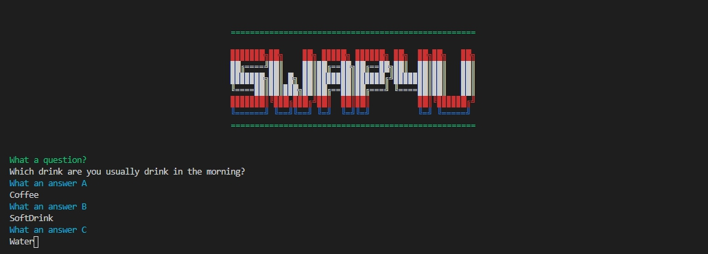

# T1A3 - Terminal Application [Swap4U]
## Links

* [T1A3 - Terminal Application [Swap4U] - GitHub Repository](https://github.com/anonaeka/T1A3)
## Title Screen


#

# Software Development Plan.
## Purpose & Scope.
### Purpose :
Swap4U is a small application that creates questionnaires where the admin can create questions as needed. It is suitable for use in creating a variety of questionnaires because the application itself can generate questions and answers independently. The application has the ability to create questionnaires in the form of Open Ended Question and Close Ended Question or other forms of questionnaires depending on the application of this user.

### Problem :
In the past, questionnaires were available in paper form distributed at various locations to ask the opinions of the target groups. The people who distribute the questionnaire will be distributed in the place that is the gathering place of that target audience. Nowadays, creating the same questionnaire is a huge waste and time-consuming process. Because due to many factors example, the current behaviour has changed and people are paying attention to communication devices or social media. Therefore, Swap4U has a direct solution to this problem because it is a small application and is also easy to use. Because no matter how many eras have passed, information from that target audience is essential to many companies and businesses. Because the information is very valuable in today's times, for example doing business or advertising, if the lack of target audience data, there is a very useless opportunity to invest.
### Target Audience :
Swap4U is a application suitable for target audiences working with trading or advertising agencies that require target audience data to be used in various applications, as this application can generate questionnaires. It can be easily applied in a variety of formats. That is, the main target audience for this application, as for the secondary audience, it is the general user. Because the application itself can do many different types of questionnaires. Users who want to use it to easily create small and large scale questionnaires. It does not have to be a user who works on commercial tasks.
### Target Audience Usage :
Swap4U usage patterns are run through Bash and are listed in the detailed installation at the end of this document.

# Features
### User System :
The user system of the Swap4U application is divided into two parts. The first part is the admin that will be able to control different parts of the system in the application. There will be no admin sign-up, the admin's ID and password are already set on the system. Unlike general users who have a signup system to be able to login to the system, do a query and send it directly to the system with the username. The admin will be able to create questionnaires and can check the questionnaires later. That is the main function of the admin user.

### Quiz & Answer Storage :
In the application, there is a system to collect information between the questionnaire and the answers from the general user who came to the questionnaire. The query that is generated by the admin is always kept the same as the user's answer. Both parts of the file are stored as a CSV file for other purposes, depending on how the user is used. The administrator can use the backup command to another file name and it will be placed in the backup folder. On the other hand, files can be deleted from the system in case they are not needed. 

    Suggestions should be backed up every time, in case you want to bring questions and answers back to use next time.

### Selection Menu [UI] :
The application has brought the Gem TTY:: Prompt to be used in this application to create the convenience of using the user. When the application starts, it shows flexibility, where users simply use the up and down buttons on the keyboard to select a menu or make a list. Overall, this function in the application is almost 95% as a menu that can be selected. Except in the function of creating a questionnaire and answering questions of general users. Moreover, doing this type of applicationming will reduce the burden of malfunctions between the application and the user.

# User Experience and Interaction
### How the user will find out how to interact with :
The application will display the results for the assistant to be seen and easy to understand with the selection system Users will be able to learn quickly because they always have explanations of their use and indicate what to do next time. The options menu system is ideal and easy to use, as it is like having the application's navigation system at all times, so its use reaches the command of the application to stop working.


    Additional instructions are to read the basic operation of the application in the introduction section.

### How the user will interact with :
In addition to the TTY:: Prompt instruction of the user in the application that will allow the user to respond by using various options. It is to enter the user's username and password in this section, including normal and admin users. It is also available for the question and answer input, as well as the required file name input, backup and delete. Moreover, it can press any key or enter to respond to the next command between some part application and the user.



### How errors will be handled by the application and displayed to the user :
Since this application uses the TTY:: Prompt gem, it significantly reduces the input errors between the user and the application. But there are parts of applications that require data entry that is beyond use. gem. Therefore, It has tools for fix errors handled in this section of the application as well. To minimize operating errors application errors between users and application.


# Control Flow Development


# Implementation plan and design
I built a Trello board to set the length of time for the application to be easier and as a reminder of what to do first. My Trello board is divided into five big features. Where in the first part determines the length of time it runs from start to deadline. The rest are components between events to remind you of what must be present. Moreover, there was a problem that arose during the creation of this app, which was added to warn what the problem is now and how to fix it. It for minimize errors before the submission process.

### [Swap4U Trello Board Online](https://trello.com/b/UNdduWY2/t1a3-terminal-applicationswap4u)


# Help documentation

## Install the application & Run the application 

- If you do not have Ruby on your computer, follow the website below.

    [Ruby Website](https://www.ruby-lang.org/en/documentation/installation/)

- Download or clone T1A3 project files onto your computer. Link below

    [Swap4U Git Hub Link](https://github.com/anonaeka/T1A3)

    or copy below to the terminal command line.

    ```
    gh repo clone anonaeka/T1A3
    ```

- If you do not have the "bundler" gem installed on your computer, please enter the following code. 
    
    In case, if you want to install it by yourself

    ```
    $ install bundler
    ```
    or
    ```
    $ gem install bundler
    ```
    Then followed by this command.
    ```
    $ bundle init
    $ bundle add colorize
    $ bundle add tty-prompt
    ```
- Using the terminal navigate to the src directory of the repository then run the application.

    ```
    $ cd src
    ```
    then
    ```
    $ ./run_app.sh
    ```

    ## Tricks
    If you want the convenience of accessing this application without taking a lot of steps.

    

    You will see the name run_app_ruby.sh. This one is different from run_app.sh, in that you will install Ruby Gems this app require. Then it will run the application after installing Ruby Gems. 
    
    By entering this command into the terminal.

    ```
    $ ./run_app_ruby.sh
    ```

## Dependencies

Swap4U is an app built to run directly on Mac systems, but on the other hand, the user part of the Window system needs to run it through the Ubuntu program.

The installation method will be in the link below.

[Ubuntu Link](https://ubuntu.com/tutorials/ubuntu-on-windows#1-overview)

### Require Ruby Gems

Swap4U utilise the following gems and the app will crash or won't work in case your device does not have gems installed.

- gem "colorize", "~> 0.8.1"

- gem "tty-prompt", "~> 0.23.0"

### Window User Issue with Bash Scripts
For some users problem in the window system, it may have trouble accessing bash. script if the app uses TTY: prompt Gem.

The basic workaround is to run directly with ruby.

```
$ ruby view/view.rb
```
or

```
$ ruby swap4u.rb
```
If you want to skip the Introduction.
